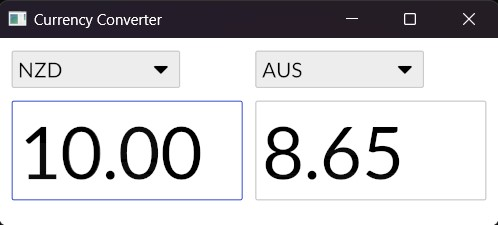

# Currency

A simple application with two currency fields, and drop downs for each specifying the denomination. Will call a currency API to find the conversion between the two, based on the last pick list option selected.

Model:
    From, FromDenom, To, ToDenom, ConversionDir (bool? enum?)

Much like the weather here app, the actual currency rates will be randomised as I can't be bothered getting an API key etc. But the exercise is more about using pick lists, styling etc. Maybe an extended goal (which may well require an API) could implement a graph showing historical rates? Plotters would be a good lib, but currently seems to have compilation/dependency issues.