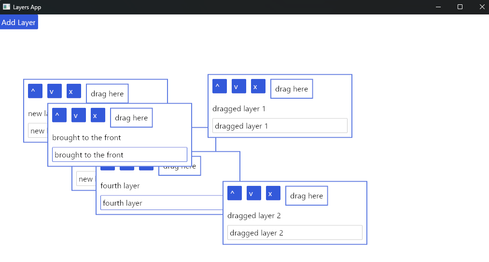

# Layers

Contains a new custom widget, OverlayManager, that takes a vector of layers. These will be presented as overlays on top of each other, in order. In this way, a window/dialog/modal-like interface can be built up, with many overlapping layers as necessary.

The example contains two things:

- a standalone [OverlayManager](./src/overlay_manager.rs) widget, in its own file, that implements nested layers by taking a vec. It can be used very simply.
- a small project built around this, that allows you to add and remove dialogs (each on its own layer), move them from the back to the front and in reverse, and drag them around

The way the project works is by simply keeping a model of layers with their order and position, and then transforming those to elements given to the OverlayManager in the view, sorted by order.

Dragging elements is slightly more complicated, but just requires using a subscription to listen for events, and using mouse events to track changes in cursor position which are applied to the currently dragged dialog/layer.