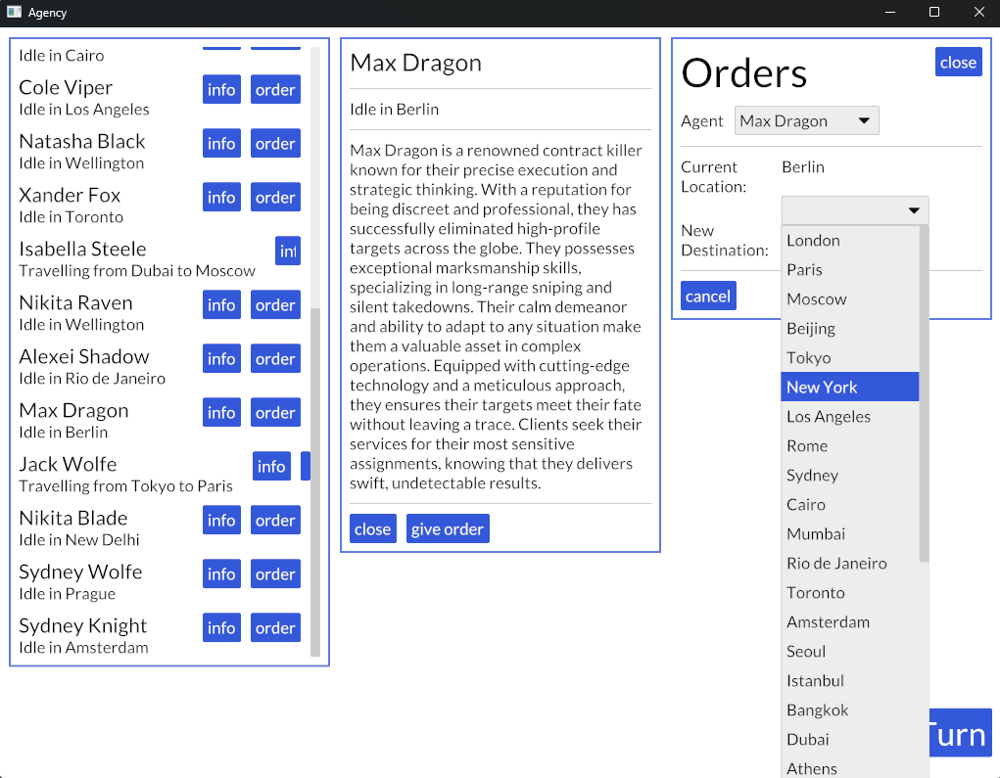

# Legion

This is an example of integrating iced with [Legion](https://github.com/amethyst/legion), an excellent, highly performant ECS (entity-component-systems) framework for rust.

It simulates a simple hitman agency company, where you can inspect agents and send them to different cities.

