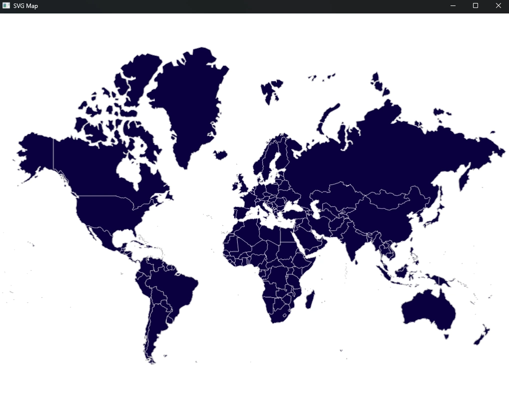

# SVG Map

**NOTE**: This project is unfinished, it just currently renders a SVG map (see below) - the intent was to overlay this with clickable icons, but it became a bit of a chore and contributed to my decision not to use iced for my side project; I am building a game, but iced seems (at present!) best for regular forms-like applications

## development notes

A world map with points on it highlighted.

The way this will likely work is by having a custom widget:

- svg, for the base layer
- map_point vector, which are all drawn in the overlay layer

each map_point is a custom widget that takes an x,y, maybe has some animation, and exposes on click etc

the overlay for the custom widget renders a column of these map_points, so can be modelled after that sort of collection mechanic.

perhaps develop an 'absolute container', like a column or a row but which takes an x,y,w,h like the overlay for each element, to render within itself.